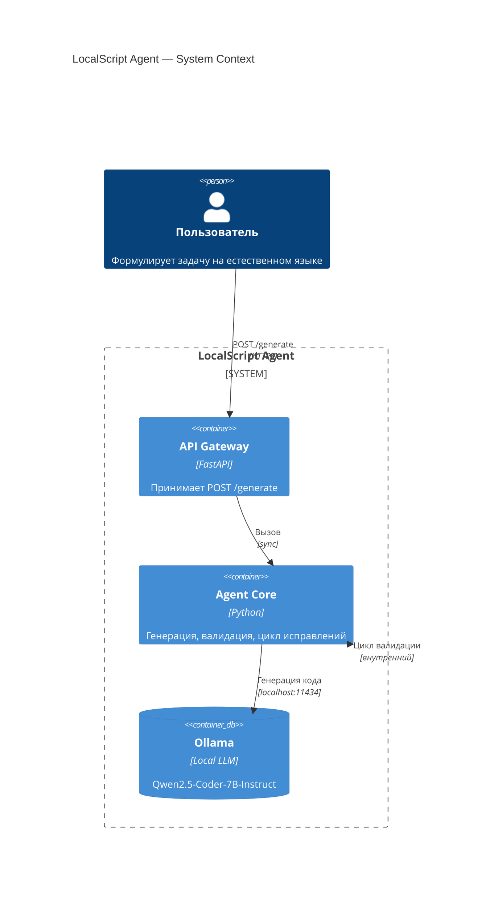

```markdown
# LocalScript Agent

Локальный агент на базе открытой языковой модели для генерации Lua-скриптов, совместимых с платформой LowCode. Решение работает в изолированном контуре без передачи данных внешним сервисам и обеспечивает итеративную валидацию кода перед возвратом результата.

## Быстрый запуск

```bash
# Клонирование репозитория
git clone <repository-url>
cd localscript

# Загрузка модели
ollama pull qwen2.5-coder:7b-instruct-q4_k_m

# Запуск инфраструктуры
docker-compose up --build
```

После завершения сборки API будет доступен по адресу `http://localhost:8080`. Сервис Ollama работает на `http://localhost:11434`.

## Системные требования

| Параметр | Минимальное значение |
|----------|----------------------|
| GPU | NVIDIA с видеопамятью от 8 ГБ |
| RAM | 16 ГБ |
| Диск | 20 ГБ свободного места |
| ПО | Docker Desktop с поддержкой GPU |

## Параметры модели

Для корректной работы в рамках выделенных ресурсов модель должна запускаться со следующими параметрами:
`num_ctx=4096`, `num_predict=256`, `batch=1`, `parallel=1`.

Данные параметры зафиксированы в конфигурации `docker-compose.yml` и передаются в запросах к Ollama API.

## API

### Эндпоинт
`POST /generate`

### Запрос
```json
{
  "prompt": "Описание задачи на естественном языке"
}
```

### Ответ
```json
{
  "code": "Сгенерированный Lua-код"
}
```

При отсутствии параметра `prompt` возвращается статус `400`. При ошибке генерации или таймауте возвращается статус `500` с описанием причины в поле `code`. Полная спецификация контракта находится в файле `docs/api-spec.yaml`.

## Архитектура



## Правила генерации LowCode

Агент учитывает ограничения платформы при формировании скриптов:
- Версия Lua: 5.5
- Доступ к переменным: только через `wf.vars` и `wf.initVariables`
- Запрещено использование JsonPath и прямых обращений к внутренним структурам платформы
- Работа с массивами: `_utils.array.new()`, `_utils.array.markAsArray()`
- Разрешенные конструкции: `if...then...else`, `while...do...end`, `for...do...end`, `repeat...until`
- Формат вывода: код оборачивается в `lua{...}lua`

Валидация выполняется локально на каждом этапе генерации. При обнаружении синтаксических или логических нарушений агент автоматически инициирует цикл исправления (максимум 2 итерации).

## Тестирование

```bash
python tests/test_samples.py
```

Набор тестов основан на публичной выборке задач из документации MWS Octapi. Проверка включает:
- Корректность генерации кода по естественному языку
- Соответствие ключевым паттернам LowCode
- Работу локального валидатора синтаксиса и правил
- Обработку ошибок и таймаутов

## Ограничения

- Требуется видеокарта NVIDIA с минимум 8 ГБ VRAM для размещения модели 7B параметров в памяти.
- Синтаксическая проверка Lua требует установленного интерпретатора `luac` (включен в Docker-образ).
- Время отклика зависит от скорости GPU и времени загрузки модели в память (обычно 10–30 секунд при первом запросе).
- Решение предоставляет только программный интерфейс (API). Для взаимодействия рекомендуется использовать curl, Postman или аналогичные инструменты.

## Безопасность и локальность

- Все компоненты развертываются локально через Docker.
- Отсутствуют исходящие соединения к внешним AI-сервисам или облачным API.
- Модель загружается однократно и выполняется в изолированном контейнере.
- Пользовательские данные, контекст запросов и сгенерированный код не покидают инфраструктуру заказчика.
- Воспроизводимость гарантируется одной командой `docker-compose up --build`.

## Разработка

Для локального запуска без контейнеризации:

```bash
export OLLAMA_HOST=http://localhost:11434
export PYTHONPATH=$(pwd)
uvicorn src.api.main:app --reload --host 0.0.0.0 --port 8080
```

Проверка подключения к модели:
```bash
curl http://localhost:11434/api/tags
```

Тестовый запрос:
```bash
curl -X POST http://localhost:8080/generate \
  -H "Content-Type: application/json" \
  -d '{"prompt": "Из списка email получи последний элемент"}'
```

## Документация и контакты

- Архитектура и диаграммы: `docs/architecture.md`
- Спецификация API: `docs/api-spec.yaml`
- Тестовые сценарии: `tests/test_samples.py`
- Репозиторий: `<ссылка на ваш репозиторий>`

Хакатон "True Tech Arena 2026" — трек LocalScript
```