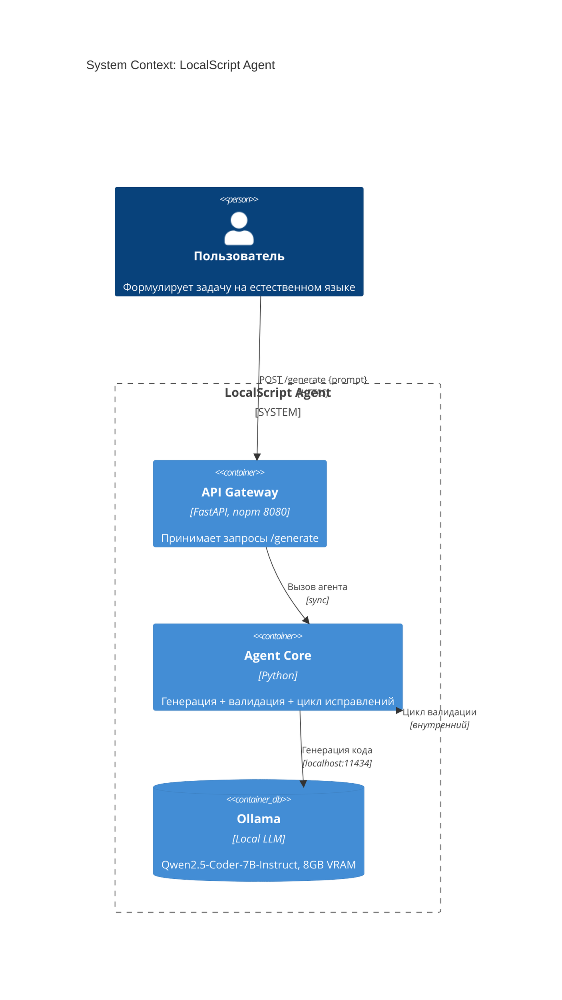
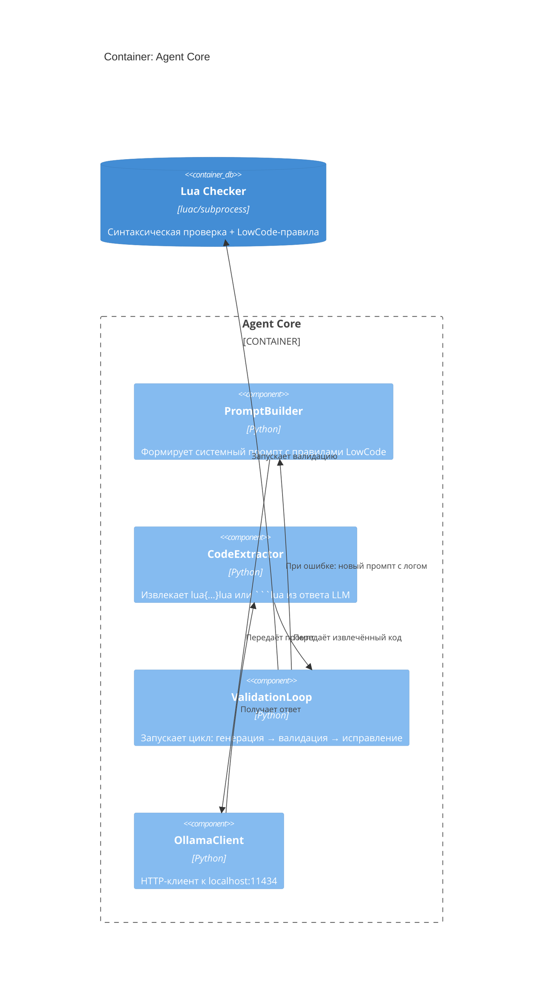

Вот код для 4 файлов. Каждый в отдельном блоке — копируй и сохраняй.

---

### 📄 `docs/architecture.md`
```markdown
# Архитектура LocalScript Agent (C4 Model)

## System Context


## Container: Agent Core


## Ключевые потоки данных

### 1. Генерация кода
```
Пользователь → POST /generate {"prompt": "..."}
                ↓
API → LuaAgent.generate(prompt)
                ↓
PromptBuilder + системные правила → Ollama API
                ↓
Ответ модели → CodeExtractor → lua{код}lua
                ↓
ValidationLoop → validate_lua() → {valid, errors, warnings}
                ↓
Если valid → вернуть {"code": "..."}
Если !valid и итераций < 2 → повтор с "Исправь: {errors}"
```

### 2. Валидация (оффлайн)
```
validate_lua(code):
  1. subprocess ["luac", "-p", "-"] → синтаксис
  2. Проверка: код не пустой?
  3. Проверка: есть wf.vars / wf.initVariables?
  4. Проверка: нет "$.", "JsonPath", "wf.data."?
  5. Проверка: есть return в конце?
  → вернуть {valid: bool, errors: [], warnings: []}
```

## Локальность и безопасность
- ✅ Все компоненты работают внутри Docker-контура
- ✅ Нет исходящих соединений к внешним AI-API
- ✅ Модель загружается локально через `ollama pull`
- ✅ Данные пользователя не покидают хост
- ✅ Воспроизводимость: одна команда `docker-compose up --build`

## Требования к ресурсам
| Компонент | Минимум | Рекомендуется |
|-----------|---------|---------------|
| GPU VRAM | 8 GB | 12 GB |
| RAM | 16 GB | 32 GB |
| CPU | 4 ядра | 8 ядер |
| Диск | 20 GB (для модели) | 50 GB |

## Параметры запуска модели
```bash
ollama run qwen2.5-coder:7b-instruct-q4_k_m \
  --num_ctx 4096 \
  --num_predict 256 \
  --batch 1 \
  --parallel 1
```
</think>